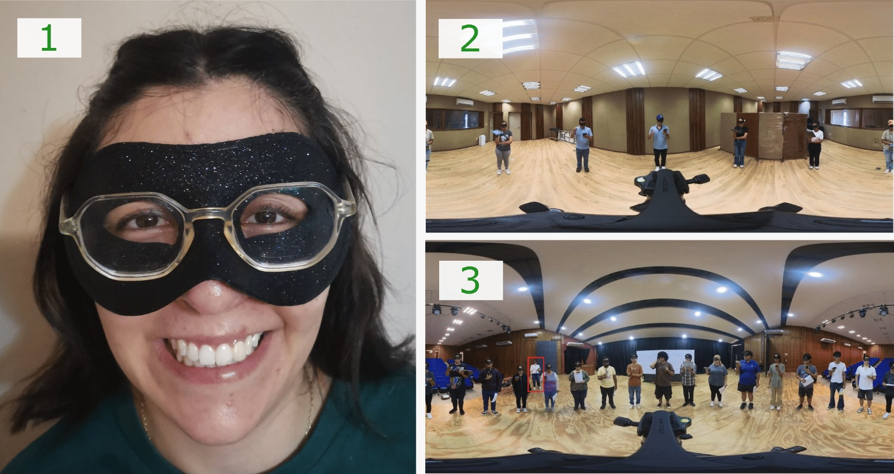
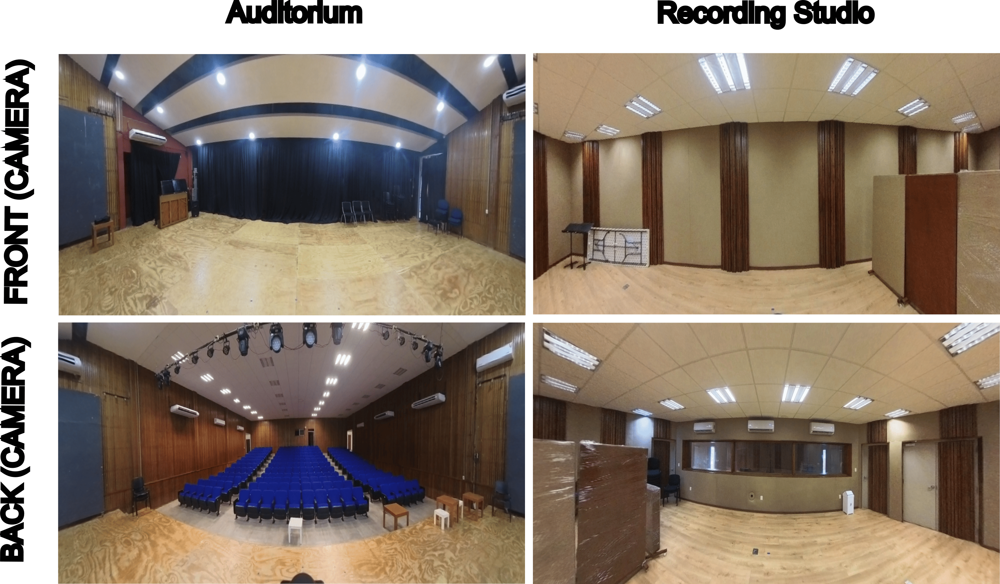
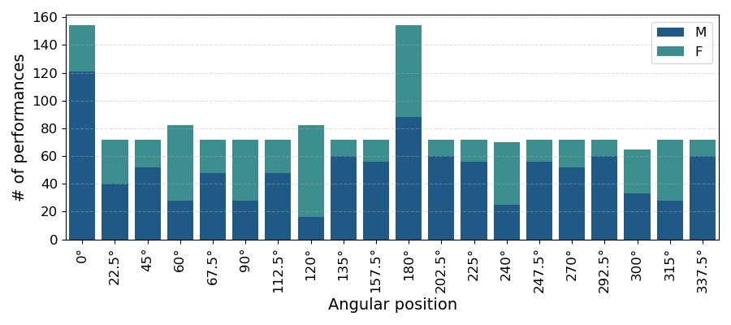
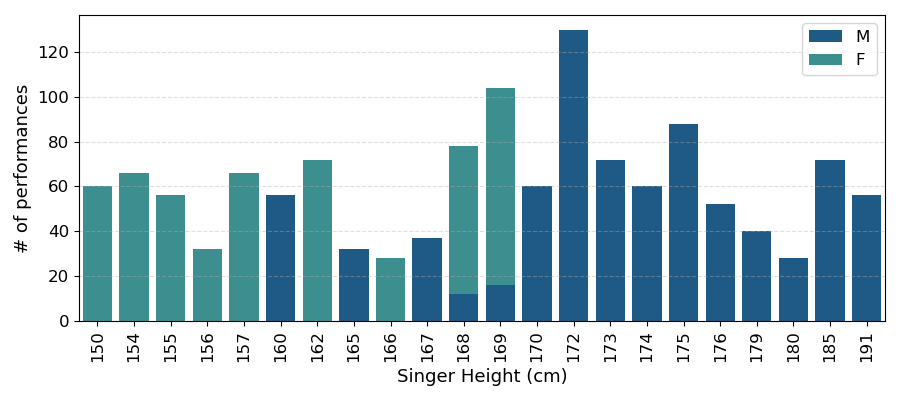
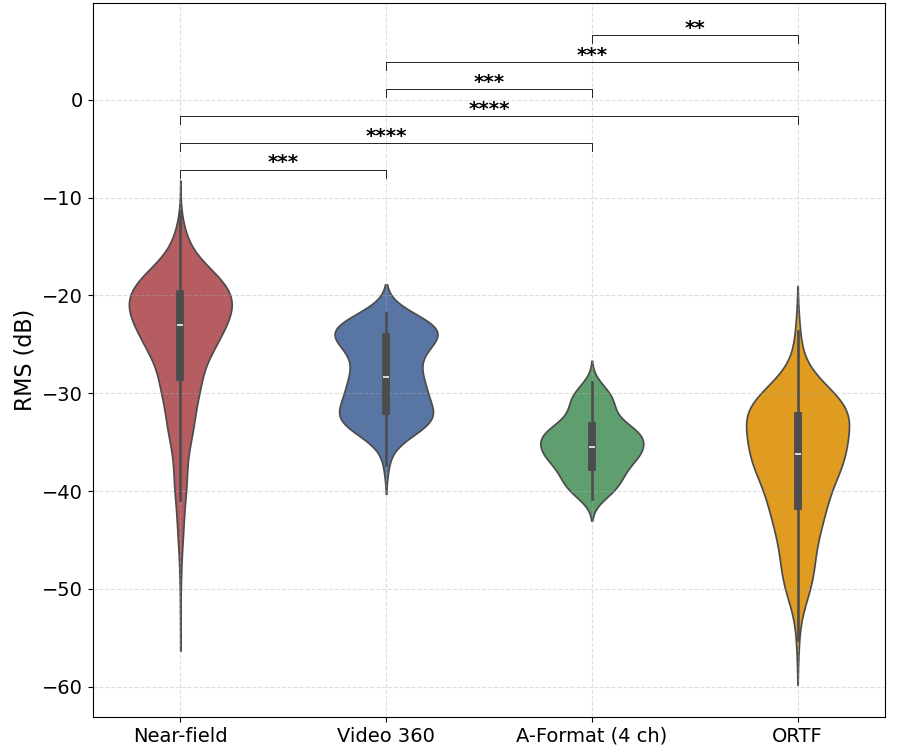
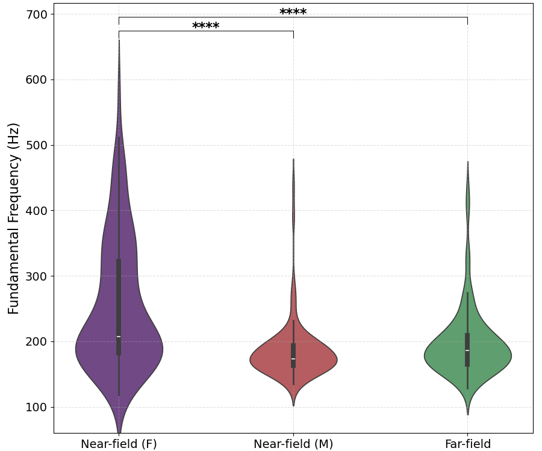
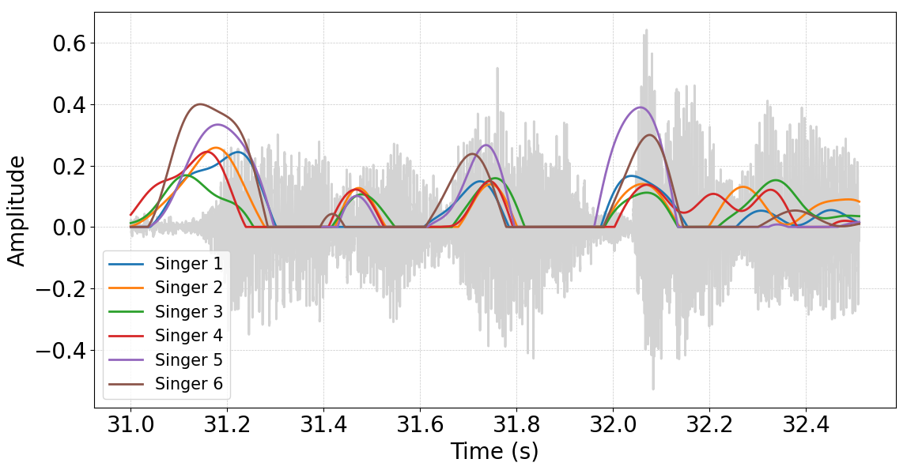

# MULTIVOX: A Spatial Audio-Visual Dataset of Singing Groups

**Gerardo Andrés Meza Gómez¹ ²**, **Mariana Sepúlveda Morales²**, **Adrian S. Roman³**, **Jorge Rodrigo Sigal Sefchovich⁴**, **Iran R. Roman⁵**

¹ Universidad Nacional Autónoma de México, CDMX, México  
² Universidad Autónoma de Tamaulipas, Tampico, México  
³ New York University, USA  
⁴ Escuela Nacional de Estudios Superiores, Morelia, México  
⁵ Queen Mary University of London, United Kingdom

---

## Abstract

Musical performance in vocal ensembles is shaped by multimodal and spatial interactions among singers and their environment. To facilitate research into these dynamics, we introduce MULTIVOX, a spatialized audio-visual dataset comprising 154 a cappella choral performances. The repertoire includes vocal warm-ups, lullabies, Latin American songs, and popular music arranged for choir, recorded in two acoustically distinct environments: an auditorium and a recording studio. Performances are conducted by small and large vocal ensembles, and captured using multiple synchronized modalities: 360° video, first-order Ambisonics, ORTF stereo, and near-field microphones for each singer.

MULTIVOX includes structured annotations specifying each performer's spatial location, singing direction, height, and gender. Not all visible performers are active in every recording, enabling analyses of selective participation. The dataset supports fine-grained analysis of individual and ensemble-level features. For example, near-field recordings enable per-singer pitch tracking and comparisons to ensemble-level fundamental frequency contours. Temporal coordination and onset alignment across performers can also be studied in detail.

With its multimodal recordings and performer-level annotations, MULTIVOX supports research in music informatics and multimodal perception, including sound event localization, ensemble synchronization, and performer-specific modeling in real-world music contexts.

**Keywords:** Multimodal datasets, Singing groups, Choral music, Sound Localization, Musician Synchrony, Sound Direction of Arrival

---

## Introduction

Musical ensemble performance is a complex activity involving rich multimodal interactions between performers, space, and sound [1,2,3,4]. In choral singing, these interactions are especially significant: the spatial arrangement of singers and its relation to the acoustics of the environment [5], the dynamics of group coordination [2,6], and each singer's facing direction (toward the conductor, the audience, or other singers) all contribute to shaping the musical outcome [7,8].

Group music-making poses substantial challenges for machine perception [9,10,11,12]. In choir singing, for example, the presence of multiple overlapping sound sources with similar timbre complicates the task of source separation [11]. Furthermore, dynamic spatial configurations challenge the localization of spatial sound events [9,10], requiring the models to adapt to changing source positions and interactions [13,6]. Additionally, the tightly coupled audio-visual cues present in ensemble singing demand sophisticated methods that can effectively the integration of visual gestures and movements to enhance auditory scene analysis [14]. Together, these intertwined characteristics necessitate multimodal approaches capable of capturing the rich spatiotemporal and sensory complexity of musical performances.

Current research in multimodal machine perception has focused on recognition and localization of acoustic scenes and audio events [15,16,17,18,19,20,21], human activity recognition and proficiency estimation [22,23] and speech understanding [24,25]. While music is taken into consideration in some of these projects, it is often treated either as background content [15,16] or as isolated sound events.

We present MULTIVOX, a free and fully open source multimodal dataset comprising 154 a cappella choral performances. The dataset includes both large and small vocal ensembles, captured using a diverse array of co-located modalities: 360° video, first-order Ambisonics and ORTF stereo configuration. Additionally, each singer's voice was recorded using a near-field microphone. Performances are annotated with detailed metadata, including the spatial position of each singer relative to the recording setup, individual height, gender and facing direction. Performances include diverse spatial configurations, and conditions where certain visible individuals are silent.

By integrating multiple audio and visual modalities, MULTIVOX aims to supports machine perception research in real-world, human-centered musical contexts. The dataset serves as a bridge between performance analysis and spatial perception, offering a structured and annotated resource for the study of multimodal ensemble singing.

---

## Related Work

Machine perception can adopt two primary vantage points: exocentric and egocentric [26,27,22,23]. Exo systems observe from an external, fixed viewpoint, while egocentric ones perceive the world from a first-person perspective [14,28,29]. This distinction is critical in fields like robotics [29,30] and HCI [29,31], where the sensor–subject relationship shapes data structure and interpretation. Applied to music, this framework distinguishes between audience-like exo capture and performer-centered ego sensing. Understanding this is essential for designing multimodal systems that model music as spatial, embodied interaction, not just acoustic output.

Yet current multimodal datasets lack coverage of interactive, performative music, particularly vocal ensemble contexts. Egocentric datasets like Ego4D [22] capture everyday human activities but do not address interactive musical performances. Exo datasets such as STARSS [15,16] support spatial audio research, including sound event detection [32], direction-of-arrival estimation [32,33,34], and visual sound localization [32,35,36,37]. In existing datasets music is either a background playback or presented as isolated instrumental sounds, and not as structured, interactive performance. Efforts to include ego and exo views in datasets [23,38], sometimes provide rich multimodal data from solo musicians but omit ensemble interaction and the dynamics of collaborative music-making. In sum, existing datasets fall short in capturing music as a participatory, spatially situated, and interactive vocal artform [15,16,23,22].

---

## The MULTIVOX Dataset

### Dataset Overview

| **Choir sizes** | **Dur.** | **Sensors** | **Songs** | **Recordings** | **Spaces** |
|-----------------|----------|-------------|-----------|----------------|------------|
| 6 & 16          | 3h       | 10+         | 18        | 154            | 2          |

*Table 1: Summary of the MULTIVOX dataset. Columns indicate the quantity of each element in the dataset: choir sizes, total duration, number of sensors used (including microphones and cameras), number of unique songs performed, total number of recordings, and number of distinct recording spaces.*

### Singer Recruitment

Participants were undergraduate music majors enrolled at the Faculty of Music & Arts (FMA) of the Universidad Autónoma de Tamaulipas (UAT). All had completed at least one choral singing course as part of their curriculum. The total participant pool consisted of 35 students. The age range was 19 to 27 (mean of 21). 11 participants identified as female (mean age of 20), and 24 identified as male (mean age of 21).

All participants were informed about the nature of the activity, and those who agreed to take part signed a consent form. To safeguard their identities, all students wore black masks during the recording sessions that did not cover their mouth nor nostrils. Figure 1 shows representative participant recording setups.

*Figure 1: (1) The mask used to conceal identity while allowing natural singing and breathing. Representative examples of choirs with 6 (panel 2) and 16 (panel 3) participants. Participants read sheet music from paper or their near-field recording devices (tablet or phone). The instructor guiding the performance stands in the background and is highlighted with a red box in panel 3.*

### Repertoire

The repertoire consists of 18 short choral pieces. 22% is made up of canons, 38% consists of short exercises and simple melodies designed to reinforce vocal placement, ensemble blend, and overall choral balance. The majority of the works (40%) are brief and built around repetitive, memorable phrases. These pieces were compiled from established pedagogical resources for choral instruction, including *Antología Coral Vol. 3* [39], *70 Cánones* [40], and *Guía de Práctica Orquestal: Coro* [41]. Popular songs are also included, arranged for a three-part choir (Soprano, Tenor and Bass) [42].

In terms of texture, 50% (9 pieces) are arranged for three voices, 17% (3 pieces) for two voices, and 33% (6 pieces) for a single voice. With regard to tonality, 61% (11 pieces) are in major keys, 22% (4 pieces) in minor keys, and 17% (3 pieces) are medieval modal works. In terms of authorship, 56% (10 pieces) of the recorded repertoire were composed by Latin American composers, 22% (4 pieces) by English composers, 17% (3 pieces) are anonymous works, and 5% (1 piece) by a North-American composer.

### Recording Spaces

The MULTIVOX recordings were conducted in two distinct locations: the "Sala Manuel Enríquez" auditorium and a recording studio. Both spaces are facilities of the FMA at the UAT, located in Tampico, Tamaulipas, Mexico. The auditorium is a large venue with a seating capacity of 250. The walls feature acoustic absorption materials. The stage area is a wooden platform slightly elevated above the floor, with a black curtain as a backdrop. In all recordings made in this space, the singers and recording devices were at the stage. The left panels of Figure 2 show this space.

In contrast, the recording studio is a smaller space with a lower ceiling and a semi-circular shape. The walls are made of wood and movable acoustic absorption panels. A glass window separates the studio from the central control cabin. The right panels of Figure 2 show this space.

*Figure 2: MULTIVOX Recording Spaces. The left panel shows front and back photographs of the "Sala Manuel Enríquez" auditorium. The right panel shows equivalent views of the recording studio at the FMA, UAT.*

### Spatial Arrangements

In all recordings, the participants were evenly placed in a circular formation two meters away from the recording equipment. The rightmost panel in Figure 3 shows the location of the circle where singers stood relative to the far-field recording equipment. The circle was divided into evenly-spaced locations, each occupied by one singer. In one setup the circle was divided into 6 parts and in another into 16. An instructor was present in most of the recordings, and her role was to guide the coordination of singers.

### Recording Equipment

Recording devices are categorized as either far-field or near-field.

In all sessions, the far-field recording setup (shown in Figure 3) included an Insta360 X3 action camera, a Zoom H3-VR Handy Recorder, and a pair of RØDE M5 microphones connected to a Zoom H4essential audio card. The 360º video was recorded at 5.7K resolution and 30 frames per second. The 360º camera also records stereo audio at 48 kHz. The Zoom H3-VR Handy Recorder captured spatial audio in A-format with a tetrahedral array (this can be converted to first-order Ambisonics using the device's proprietary software) at a sampling rate of 48 kHz and 24-bits. The RØDE microphones were configured in a standard ORTF arrangement and recorded at 48 kHz with 32-bit floating-point.

All devices were mounted on a tripod. The 360° camera was positioned at a height of 1.7 m, the Ambisonic microphone at 1.5 m, and the ORTF capsules directly below it at a height of 1.4 m.

Each participant recorded their own voice using a near-field microphone, which consisted of their personal hand-held smartphone or tablet. While the devices varied widely in brand and model (spanning both iOS and Android) we embraced this diversity and standardized the captured audio to ensure consistency across recordings. This approach reflects real-world usage and enhances the dataset's ecological validity.

*Figure 3: (1) the far-field recording devices and their relative height positioning; (2) a representative photo of the far-field recording setup; (3) the equipment placement and distance relative to the circle where singers stood.*

### Recording Session Protocol

A total of 10 recording sessions were conducted, with five sessions taking place in each of the two spaces. Each recording session consisted of four iterations of the assigned repertoire.

Before each session began, positions for singers and the far-field recording equipment were marked on the floor. Each singer was assigned a position and started wearing the mask. A logbook with each singer's name, assigned position, gender, and height was filled out. Participants were informed about the repertoire to be performed and in which order, as well as which individuals would remain silent throughout the first iteration. After giving participants a chance to ask any clarification questions they had, a brief sound check was done to ensure that devices were recording properly.

Participants were then instructed to start recording with their personal phones or tablets to capture the near-field of their singing. A research scientist (who is the first author of this article) was responsible for starting and stopping the recording equipment. He remained hidden during performances: in the auditorium dressing room behind the black curtain or in the control room adjacent to the recording studio.

In the first iteration, the entire choir performed facing the recording equipment. Some singers were assigned to remain silent. In the second iteration, only male singers sang and females remained quiet in place. In the third iteration, only female singers sang and males remained quiet in place. Before the fourth iteration, participants were instructed to stop recording with their near-field devices, and the research scientist stopped the far-field recording equipment devices. All participants were then informed of an assigned facing direction (either facing toward the microphone, away from it, or perpendicular to it) as well as who would remain silent. After a brief sound check, recording resumed for the final fourth iteration.

In all iterations, participants who were not singing remained present and continued recording with their near-field personal devices, always facing the far-field recording setup.

At the end of each session, participants submitted two audio recordings (one continuous recording from the first three iterations and one separate recording with the fourth iteration) from their personal near-field devices via file transfer to a central computer. The research scientist received and organized all files in said computer.

### Detailed Session Information

All five studio sessions feature six singers. Four out of the five auditorium sessions feature a choir with 16 singers (the other one features 6). The dataset's metadata indicates each session's participant demographics (gender and height), which singers were assigned to be silent during the first and fourth iteration, as well as the facing orientations assigned during the fourth iteration. Complete details are provided in the supplemental materials accompanying this paper.

### Data Standardization, Alignment, and Annotation

All videos were converted to a resolution of 1960 × 980 pixels, consistent with the STARSS23 dataset [16]. All audio files were converted to WAV format at 44.1 kHz and 24-bits. All recording modalities were temporally aligned using the cross-correlation method on the audio signals, followed by manual verification. Each session's videos recording was inspected to annotate the start and end times of each song performed. A python script was written to automatically segment each sing performance across all modalities.

In summary, for each of the 154 song performances, MULTIVOX provides synchronized multimodal recordings with annotations. These include the performed song's name and tonality, the name of the recording space, the spatial position of each participant, their facing direction, their gender, height, and information on whether they were actively singing during a particular song performance. This information is available as a CSV metadata file provided with the dataset.

---

## Analysis of MULTIVOX's Multimodal Features

The following sections present analyses that demonstrate the unique features captured by MULTIVOX through its modalities. We illustrate the spatial distributions of singers present across performance recordings, as well as the differences and similarities between modalities.

### Performance Distribution by Angular Position

Given that singer spatial location is a central feature of our dataset, we examined how angular positions around the far-field recording setup are distributed across all performances. Figure 4 shows this data. Each position corresponds to a discrete angle (in 22.5° increments) starting at an azimuth angle of 0º in front of the far-field microphones and 360º camera. We cover the full 360° range around. The distribution is relatively uniform, with two peaks at 0° and 180° (these angles correspond to the locations where singers were present in both choir sizes). We color code the ratios between male and female singers.

*Figure 4: Distribution of singer angular positions across all performances. Each location is broken down by its ratio between male and female singers.*

### Singer Height Distribution

Figure 5 presents the number times a specific singer height is present across recorded performances. We also color code the ratios between male and female singers. The most common height was 172 cm. In general we observe a divide of heights based on gender. Most heights between 150 cm and 169 cm consist of female singers, while heights above 170 cm consists of male singers.

*Figure 5: Distribution of singer heights across all performances. Each height is broken down by its ratio between male and female singers.*

### Amplitude Difference Between Audio Captures

To characterize the differences between the various recorded modalities from the perspective of signal amplitude, we hypothesize that near-field devices, being closer to the singers, capture louder singing compared to the far-field microphones. Figure 6 effectively demonstrates that the average RMS of the near-field devices is significantly higher than that of the other modalities.

*Figure 6: RMS comparison across audio modalities. Each violin plot represents the RMS distribution for a recording modality. Brackets indicate pairwise t-test comparisons with significance levels: **** p < 1e-50, *** p < 1e-10, ** p < 0.001, * p < 0.05. Near-field recordings show significantly higher RMS.*

### F0 Analysis Across Modalities

We wanted to characterize the differences between the various recorded modalities from the perspective of pitch. We hypothesize that female near-field devices capture a higher F0 value than all other devices. Figure 7 effectively demonstrates this effect.

*Figure 7: Comparison of F0 content in near-field recordings of female singing against near-field recordings of male singing and all far-field recordings. **** indicates a significant pairwise t-test comparison (p < 0.00001). F0 values for female near-field recordings are significantly higher. No significant difference was found between male near-field recordings and far-field ones.*

### Synchronization Analysis Across Modalities

Given that all signals were synchronized, we aimed to investigate the micro-timing deviations among singers that occur in ensemble music-making. We hypothesize that one will be able to see this micro-timing differences by comparing the the near-field captures between singers. Figure 8 illustrates how the dataset captures both individual vocal events and how they come together to form an ensemble. Despite natural micro-timing differences, singer onsets closely align with energy peaks in the far-field recording, demonstrating ensemble synchrony. This highlights a unique value of the dataset's multimodality: the inclusion of synchronized near-field (per-singer) and far-field recordings. This enables detailed modeling and analysis of coordination, timing, and expressive nuance in group vocal performances.

*Figure 8: Overlay of individual singer onsets (colored lines) derived from the acoustic envelope's rectified derivative of near-field recordings. The gray waveform is the reference far-field audio captured by the 360º camera. Each line shows moments of vocal attack across singers, revealing subtle micro-timing differences.*

---

## Conclusion

We have presented MULTIVOX, a multimodal dataset of singing groups. This dataset captured 154 musical performances with near-field and far-field modalities in two distinct spaces with groups of 6 and 16 singers. Modalities that correspond to each performance are aligned and annotated with metadata including song name, tonality, recording space, the spatial position of each participant within the recording environment, their singing direction, their gender, height, and information on whether they were actively singing.

We also performed an analysis of the general distribution of gender and height distribution followed by a comparative analysis of loundness, pitch and micro-timing between singers, demonstrating the added value that near-field recordings provide.

When considered collectively, the information captured through multiple modalities, along with the associated metadata and the analyses conducted in this study, demonstrates that MULTIVOX is a new and valuable resource for the study of interactive and performative music, particularly when compared to existing resources in the field.

Future work will be able to use MULTIVOX to develop SELD models that can carry out the task in the domain of musical ensembles. The dataset will also enable machine understanding of musical nuance in performance, including coordination, expressivity, and singing strategies/techniques.

---

## References

[1] H. Jers and S. Ternström, "Vocal Ensembles," *The Oxford Handbook of Music Performance*, vol. 2, p. 399, 2022.

[2] M. C. Lim, "In pursuit of harmony: The social and organisational factors in a professional vocal ensemble," *Psychology of Music*, vol. 42, no. 3, pp. 307-324, 2014.

[3] A. Schütz, "Making music together: A study in social relationship," *Social research*, pp. 76-97, 1951.

[4] J. Bensman, "Introduction: The phenomenology and sociology of the performing arts," *Performers and performances: The social organisation of artistic work*, no. 4, pp. 2-37, 1983.

[5] M. J. Bonshor, "Confidence and choral configuration: The affective impact of situational and acoustic factors in amateur choirs," *Psychology of Music*, vol. 45, no. 5, pp. 628-644, 2017.

[6] K. E. Briggs, "Movement in the choral rehearsal: The singers' perspective," *The Choral Journal*, vol. 52, no. 5, p. 28, 2011.

[7] A. H. Marshall, D. Gottlob, and H. Alrutz, "Acoustical conditions preferred for ensemble," *The Journal of the Acoustical Society of America*, vol. 64, no. 5, pp. 1437-1442, 1978.

[8] S. Ternström, "Choir acoustics: an overview of scientific research published to date," *International Journal of Research in Choral Singing*, vol. 1, no. 1, pp. 3-12, 2003.

[9] K. Shimada, Y. Koyama, S. Takahashi, N. Takahashi, E. Tsunoo, and Y. Mitsufuji, "Multi-accdoa: Localizing and detecting overlapping sounds from the same class with auxiliary duplicating permutation invariant training," in *ICASSP 2022-2022 IEEE international conference on acoustics, speech and signal processing (ICASSP)*, pp. 316-320, 2022.

[10] S. Adavanne, A. Politis, J. Nikunen, and T. Virtanen, "Sound event localization and detection of overlapping sources using convolutional recurrent neural networks," *IEEE Journal of Selected Topics in Signal Processing*, vol. 13, no. 1, pp. 34-48, 2018.

[11] L. Fadil, A. K. A. Hassan, and H. B. Alwan, "Employing Chroma-gram techniques for audio source separation in human-computer interaction," in *AIP Conference Proceedings*, vol. 3264, no. 1, p. 030024, 2025.

[12] R. Chakraborty, C. Nadeu, and T. Butko, "Detection and Positioning of Overlapped Sounds in a Room Environment," in *INTERSPEECH*, pp. 1508-1511, 2012.

[13] J. Hylton, "Keeping your choir on the move," *Music Educators Journal*, vol. 74, no. 3, pp. 31-34, 1987.

[14] G. B. Seighman, "Exploring the science of ensemble gestures, emotion, and collaboration in choral music making," *The Choral Journal*, vol. 55, no. 9, p. 8, 2015.

[15] A. Politis, K. Shimada, P. Sudarsanam, S. Adavanne, D. Krause, Y. Koyama, N. Takahashi, S. Takahashi, Y. Mitsufuji, and T. Virtanen, "STARSS22: A dataset of spatial recordings of real scenes with spatiotemporal annotations of sound events," *arXiv preprint arXiv:2206.01948*, 2022.

[16] K. Shimada, A. Politis, P. Sudarsanam, D. A. Krause, K. Uchida, S. Adavanne, A. Hakala, Y. Koyama, N. Takahashi, S. Takahashi, Y. Mitsufuji, and T. Virtanen, "STARSS23: An audio-visual dataset of spatial recordings of real scenes with spatiotemporal annotations of sound events," *Advances in neural information processing systems*, vol. 36, pp. 72931-72957, 2023.

[17] D. Stowell, D. Giannoulis, E. Benetos, M. Lagrange, and M. D. Plumbley, "Detection and classification of acoustic scenes and events," *IEEE Transactions on Multimedia*, vol. 17, no. 10, pp. 1733-1746, 2015.

[18] A. Mesaros, T. Heittola, A. Eronen, and T. Virtanen, "Acoustic event detection in real life recordings," in *2010 18th European signal processing conference*, pp. 1267-1271, 2010.

[19] D. Barchiesi, D. Giannoulis, D. Stowell, and M. D. Plumbley, "Acoustic scene classification: Classifying environments from the sounds they produce," *IEEE Signal Processing Magazine*, vol. 32, no. 3, pp. 16-34, 2015.

[20] K. Nagatomo, M. Yasuda, K. Yatabe, S. Saito, and Y. Oikawa, "Wearable SELD dataset: Dataset for sound event localization and detection using wearable devices around head," in *ICASSP 2022-2022 IEEE International Conference on Acoustics, Speech and Signal Processing (ICASSP)*, pp. 156-160, 2022.

[21] S. S. Kushwaha, I. R. Roman, M. Fuentes, and J. P. Bello, "Sound source distance estimation in diverse and dynamic acoustic conditions," in *2023 IEEE Workshop on Applications of Signal Processing to Audio and Acoustics (WASPAA)*, pp. 1-5, 2023.

[22] K. Grauman et al., "Ego4d: Around the world in 3,000 hours of egocentric video," in *Proceedings of the IEEE/CVF conference on computer vision and pattern recognition*, pp. 18995-19012, 2022.

[23] K. Grauman et al., "Ego-exo4d: Understanding skilled human activity from first-and third-person perspectives," in *Proceedings of the IEEE/CVF Conference on Computer Vision and Pattern Recognition*, pp. 19383-19400, 2024.

[24] H. Wang and P. Chu, "Voice source localization for automatic camera pointing system in videoconferencing," in *1997 IEEE International Conference on Acoustics, Speech, and Signal Processing*, vol. 1, pp. 187-190, 1997.

[25] P. Swietojanski, A. Ghoshal, and S. Renals, "Convolutional neural networks for distant speech recognition," *IEEE Signal Processing Letters*, vol. 21, no. 9, pp. 1120-1124, 2014.

[26] A. Thatipelli, S.-Y. Lo, and A. K. Roy-Chowdhury, "Egocentric and exocentric methods: A short survey," *Computer Vision and Image Understanding*, p. 104371, 2025.

[27] S. Ardeshir and A. Borji, "An exocentric look at egocentric actions and vice versa," *Computer Vision and Image Understanding*, vol. 171, pp. 61-68, 2018.

[28] R. Khirodkar, A. Bansal, L. Ma, R. Newcombe, M. Vo, and K. Kitani, "Ego-Humans: An Ego-Centric 3D Multi-Human Benchmark," in *Proceedings of the IEEE/CVF International Conference on Computer Vision (ICCV)*, pp. 19807-19819, 2023.

[29] D. Damen et al., "Scaling Egocentric Vision: The EPIC-KITCHENS Dataset," in *Proceedings of the European Conference on Computer Vision (ECCV)*, 2018.

[30] A. Nair, D. Chen, P. Agrawal, P. Isola, P. Abbeel, J. Malik, and S. Levine, "Combining self-supervised learning and imitation for vision-based rope manipulation," in *2017 IEEE international conference on robotics and automation (ICRA)*, pp. 2146-2153, 2017.

[31] T. Zhang, Z. McCarthy, O. Jow, D. Lee, X. Chen, K. Goldberg, and P. Abbeel, "Deep imitation learning for complex manipulation tasks from virtual reality teleoperation," in *2018 IEEE international conference on robotics and automation (ICRA)*, pp. 5628-5635, 2018.

[32] Q. Wang et al., "The nerc-slip system for sound event localization and detection with source distance estimation of dcase 2024 challenge," *DCASE2024 Challenge, Tech. Rep.*, 2024.

[33] H. Yu, "DOA and event guidance system for sound event localization and detection with source distance estimation," *DCASE2024 Challenge*, 2024.

[34] J. W. Yeow, E.-L. Tan, J. Bai, S. Peksi, and W.-S. Gan, "Squeeze-and-excite resnet-conformers for sound event localization, detection, and distance estimation for dcase2024 challenge," *DCASE2024 Challenge*, 2024.

[35] A. S. Roman, B. Balamurugan, and R. Pothuganti, "Enhanced sound event localization and detection in real 360-degree audio-visual soundscapes," *arXiv preprint arXiv:2401.17129*, 2024.

[36] Q. Wang et al., "The nerc-slip system for sound event localization and detection with source distance estimation of dcase 2024 challenge," *DCASE2024 Challenge, Tech. Rep.*, 2024.

[37] H. Hong, Q. Wang, R. Wei, M. Cai, and X. Fang, "MVANet: Multi-Stage Video Attention Network for Sound Event Localization and Detection with Source Distance Estimation," in *ICASSP 2025-2025 IEEE International Conference on Acoustics, Speech and Signal Processing (ICASSP)*, pp. 1-5, 2025.

[38] H. Pedroza, W. Abreu, R. M. Corey, and I. R. Roman, "Guitar-TECHS: An Electric Guitar Dataset Covering Techniques, Musical Excerpts, Chords and Scales Using a Diverse Array of Hardware," *arXiv preprint arXiv:2501.03720*, 2025.

[39] J. J. Valero, "Antología Coral Volumen 3," *Consejo Nacional para la Cultura y las Artes*, 1993.

[40] V. Hemsy de Gainza, "70 cánones de aquí y de allá para la enseñanza musical," *Ricordi*, 1993.

[41] U. M. Ortega Ortega, "Guía Práctica Orquestal, Coro," *Asociación Azteca Amigos de la Cultura y las Artes A.C.*, 2023.

[42] Recurso Coral, "Recurso Coral Información Útil para Directores y Cantantes de Coro," 2021. [Online]. Available: https://recursocoral.com.ar/
